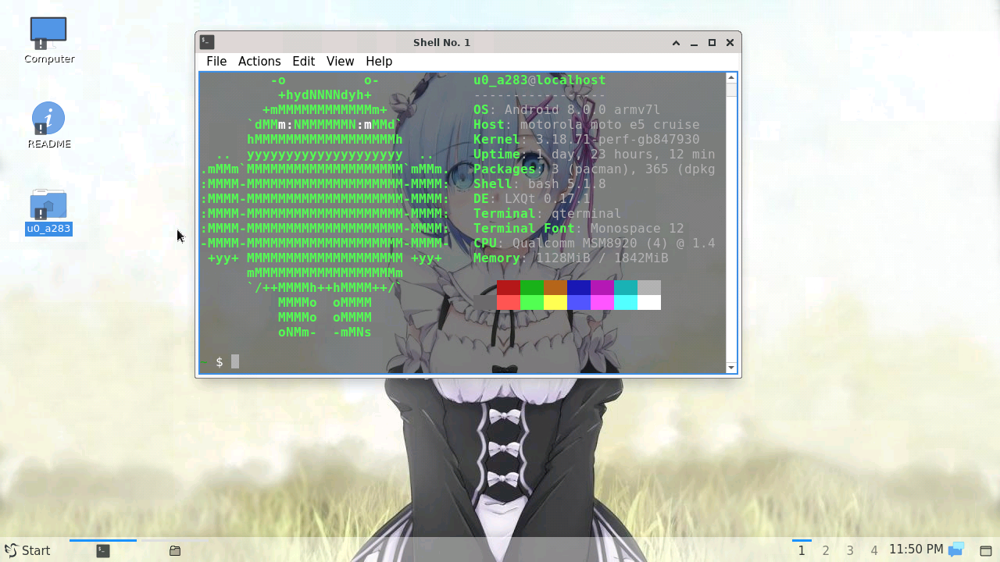
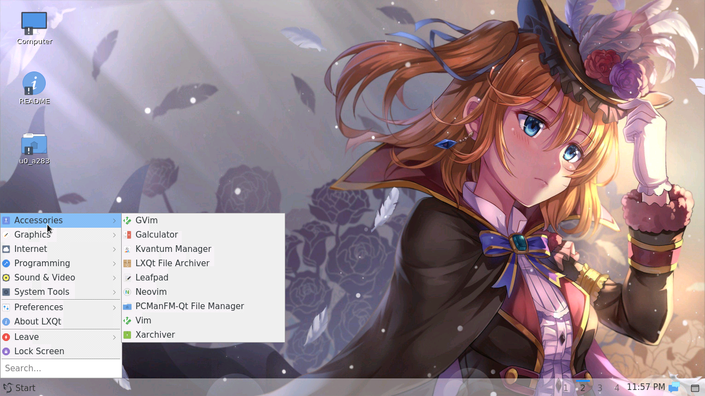
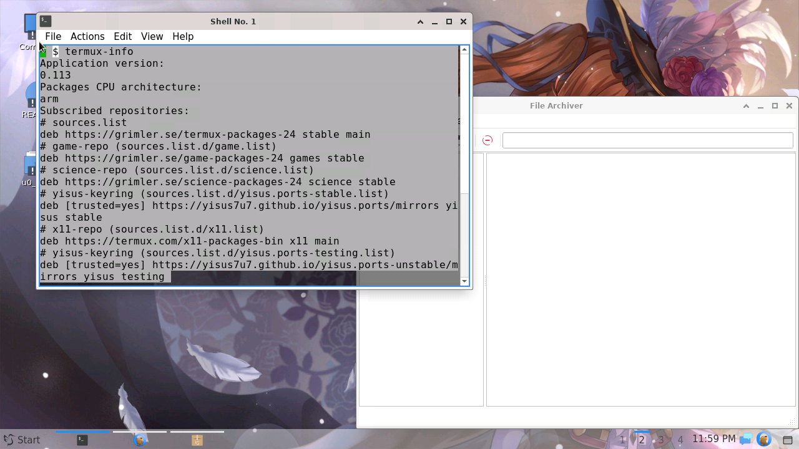
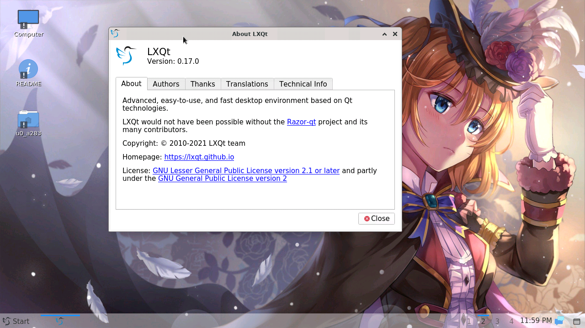

# termux-desktop-lxqt
Install a simple and very lively desktop in termux 


### What is termux-desktop-lxqt? 

Termux desktop lxqt is a configuration of the very recent lxqt environment, available in x11 termux
your goal is to be a livean, and very simple! 
termux-desktop-lxqt is the most optimized desktop you'll find for termux-x11 so far 

## screenshots









# installation 

```
pkg update && pkg upgrade

pkg install git

git clone https://github.com/Yisus7u7/termux-desktop-lxqt 

cd termux-desktop-lxqt 

bash install-desktop-lxqt.sh
```
## contribute 

You can help the project by correcting bugs and adding improvements to the project 
extraction requests will be reviewed and if they are correct they will be accepted 

Don't forget to share and leave your 🌟 
