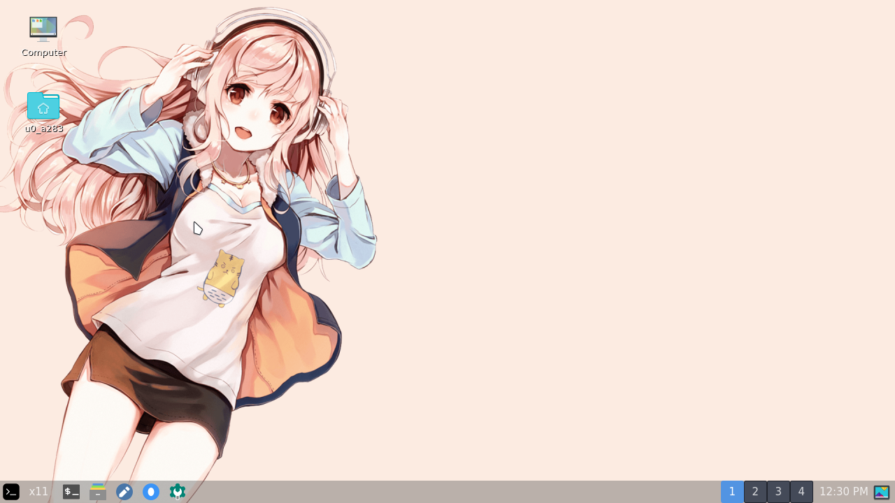
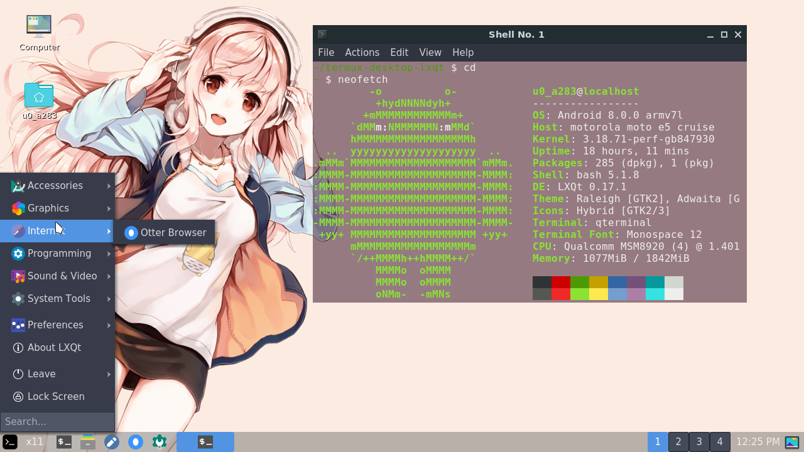
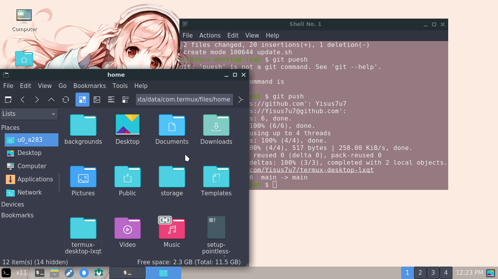
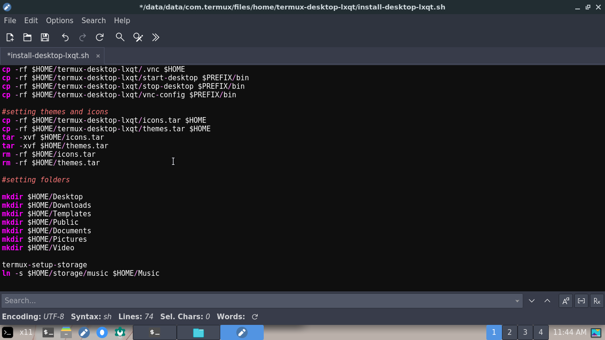
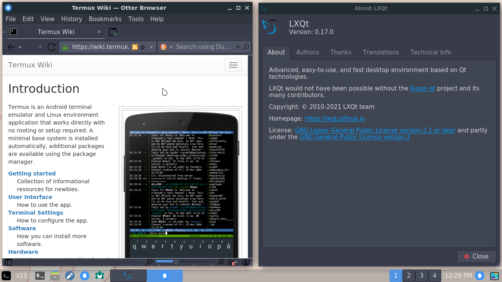

# Termux-desktop-lxqt
Install a simple and very lively desktop in termux 



> Current version of this project : v2.1.3

### What is Termux-desktop-lxqt? 

Termux desktop lxqt is a configuration of the very recent lxqt environment, available in x11 termux
your goal is to be a light, and very simple! 
termux-desktop-lxqt is the most optimized desktop you'll find for termux-x11 so far 

## Requirements 

- Android 7 or higher (8, 9, 10, 11, 12)
- [termux](https://f-droid.org/en/packages/com.termux/) 
- [vnc viewer](https://play.google.com/store/apps/details?id=com.realvnc.viewer.android) 
You can also use bvnc, nethunter kex, bvnc pro. 
## Notes 

To resize the vnc to your screen 
Use :

```
vnc-config 
```

And edit the geometry parameters 

- lxqt is made 100% in qt5, does not use gtk

- This desktop is super lightweight and optimized

Since this repo is in beta, If you want something nicer you can try this :

https://github.com/Yisus7u7/termux-desktop-xfce

The objective of this project is aimed at cell phones with little space or low resources 

## screenshots









# installation 

```
cd $HOME
pkg update && pkg upgrade
pkg install git
git clone --depth 1 https://github.com/Yisus7u7/termux-desktop-lxqt 
cd termux-desktop-lxqt 
bash install-desktop-lxqt.sh
```

## use 


To start the vnc server :

```
start-desktop
```

To close it :

```
stop-desktop
```

## Contribute 

You can help the project by correcting bugs and adding improvements to the project 
extraction requests will be reviewed and if they are correct they will be accepted 

Don't forget to share and leave your 🌟 
